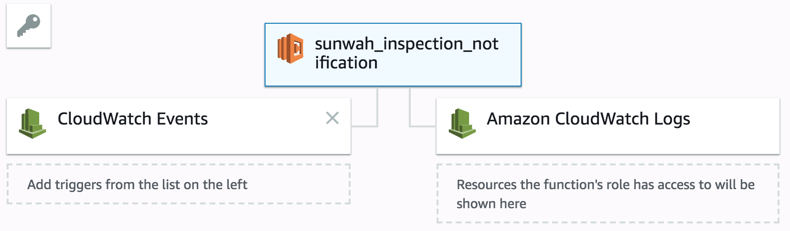

# Restaurant Inspection Notifications

This code monitors Chicago's [Open Data Portal](https://data.cityofchicago.org/)
for new inspections at your favorite restaurant. It runs on AWS and posts the 
results to Slack.

Here's how we'll do it:

1. Query the [Food Inspections](https://data.cityofchicago.org/Health-Human-Services/Food-Inspections/4ijn-s7e5/data)
dataset once a day.
2. If an inspection record exists for your favorite restaurant, post a short summary and 
a link to the complete record to Slack. 

## Slack Webhook
Slack has a Python package, but you have to jump through a bunch of hoops to install it
for Lambda. We'll use the `requests` module (available from `botocore.vendored`) to
post with webhooks. Slack's [documentation](https://api.slack.com/incoming-webhooks)
explains how to set it up. You'll need the URL Slack gives you.

## Lambda Function

1. Choose `create function`.
2. Choose `author from scratch`.
3. Provide a name, choose `Python 3.6`, `create new role from templates`, name it, and 
then attach `Basic Edge Lambda permissions` and `KMS decryption permissions`.
4. Add `Cloudwatch Events` to the left and, if it's not there, `Amazon Cloudwatch Logs`
to the right. 
5. Click on `Cloudwatch Events` and scroll down.
6. Choose `create new rule`. Paste your cron expression in `schedule expression`. 
To run the query every day at noon GMT, enter `cron(00 12 ? * * *)`.
7. Click on the box with the function name.
8. Paste `inspection_function.py` into the code box.
9. Define three environment variables:
  * `SLACK_URL`: the URL Slack created for you when you created the webhook.
  * `CHANNEL`: the Slack channel where you want your messages to appear, e.g. `#general`.
  * `AKA_NAME`: The beginning of your favorite restaurant's AKA name. For Sun Wah it's `%20%27SUN%20WAH%27`.
 
